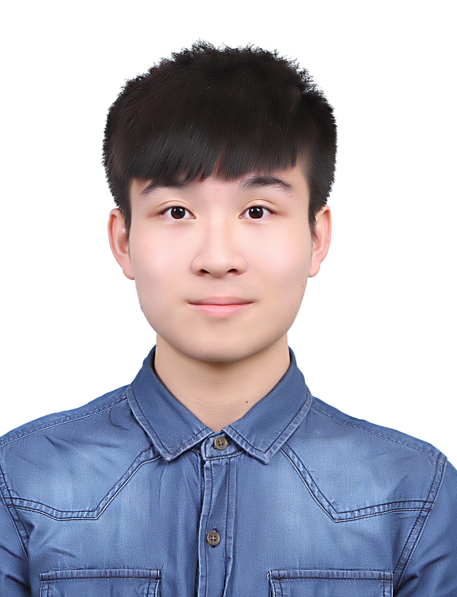

# Yu-cheng (Rick) Chen

## § Welcome to my personal website §

## About Me

* I’m **Yu-cheng(Rick)Chen(陳昱誠)**,a student in the Department of **Computer Science Information Engineering** in **National Quemoy Unervisity**
* Born on **October 10, 2000**, I am the eldest of two children in my family
## Interests and Personalities 
* I'm a **curious person** who **enjoys trying new things** since I was a kid. I enjoy **basketball**, **playing guitar**, and **reading books** outside of my leisure time.
*  I like to **spread joy** to my family and friends around me, and I will put my heart and soul into things that interest me.
## Learning experience
|name | time |  
|---- |------|
|completed **ASVDA Deep learning for Industial Big Data**  | Aug 24, 2020 to Aug 27, 2020 |
|completed **NCKU Human Research Ethdics** | Oct 30,2020|
|passed **TQC Mobile Device Application Professional Level** | May 1,2021|
|passed **Center for Taiwan Academic Research Ethics Education Certificate of Completion**  | Jun 26,2021 |
|passed **TQC Linux Network Management Professional Level** |Nov 13,2021 |
|passed **TQC Fundamentals of e-Commerce Professional Level** | Nov 13,2021 |

## Work experience
|name | time |
|----| ----|
|**銀座杏子日式豬排新竹大魯閣店**擔任**內場工讀生** | 2019. 03 ~ 2019.08|
|**金沙大地國際渡假飯店**擔任**櫃台服務生** |2020.09 ~ 2021.02|

## contact me 

